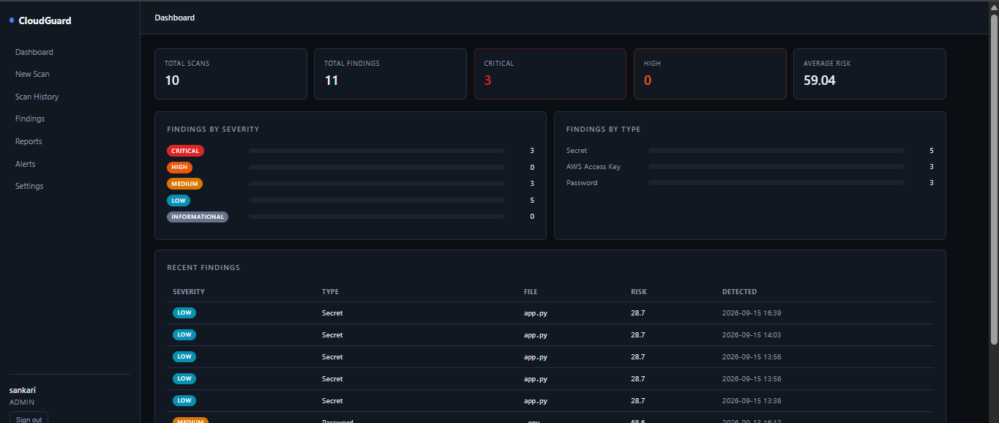
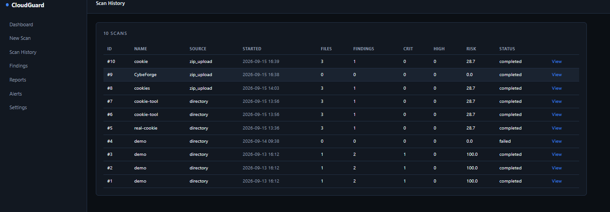
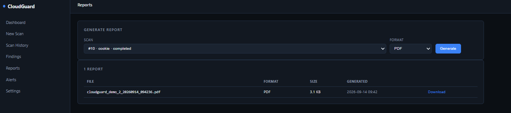
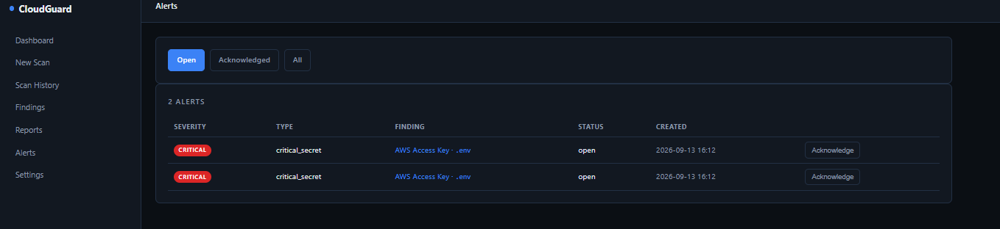
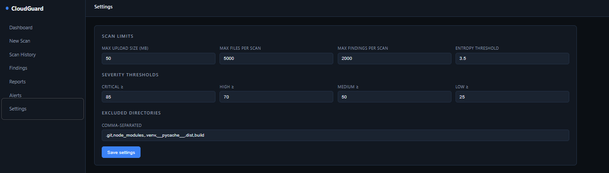
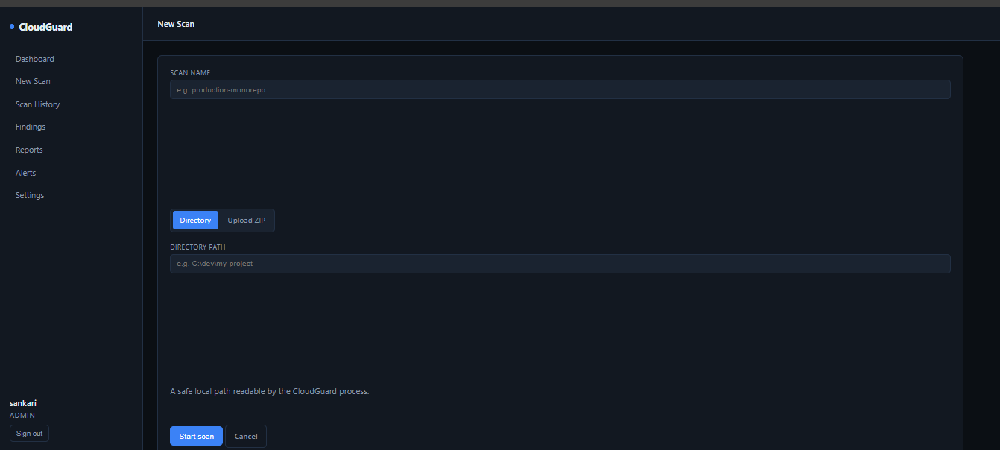
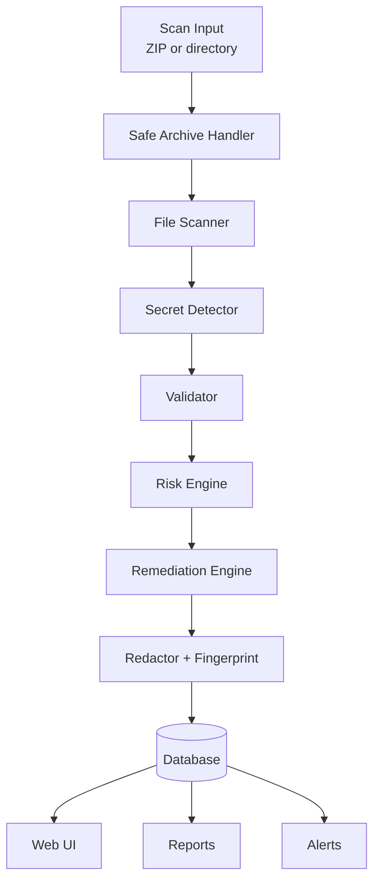

<div align="center">

# CloudGuard

### Cloud Secret Exposure Detection & Risk Analysis Platform

**Find leaked credentials before attackers do.**

[](https://www.python.org/)
[](https://flask.palletsprojects.com/)
[](https://www.sqlalchemy.org/)
[](#testing)
[](Dockerfile)
[](LICENSE)

</div>

---

## Overview

**CloudGuard** is a security platform that scans source code, configuration files, and archives for exposed secrets — API keys, cloud credentials, tokens, private keys, and database connection strings.

It is not a regex script. It combines **multi-strategy detection**, **context-aware false-positive reduction**, **provider-specific validation**, and an **explainable risk engine** to produce findings a security team can act on immediately.

> **Core principle:** No plaintext secret ever reaches the database. Every finding is redacted at write time and stored only as a partial mask plus a SHA-256 fingerprint.

### At a glance

| Metric | Value |
|---|---|
| Detection strategies | Regex + Shannon entropy + context analysis |
| Providers validated | AWS, GitHub, Slack, Stripe, Google, generic |
| Report formats | JSON, CSV, HTML, PDF |
| Test suite | 220+ pytest tests across 17 modules |
| Deployment | Local, Docker, docker compose |
| Storage | SQLite by default, any SQLAlchemy URI |

---

## The Problem

Credentials leaked into source control are one of the most common root causes of cloud breaches.

| Reality | Impact |
|---|---|
| A single AWS key in a public repo can lead to account takeover within minutes | Data loss, financial fraud |
| Long-lived credentials in source cannot be rotated quickly | Extended attacker dwell time |
| Manual review does not scale — one repo can hold thousands of files | Missed exposures |
| Existing tools are heavy SaaS or one-off regex scripts | Poor fit for self-hosted teams |

CloudGuard answers three questions fast:

1. **What** secrets are exposed?
2. **How bad** is each one?
3. **What do I do** about it, right now?

---

## Features

**Detection**
- Regex rules for AWS, GitHub, Slack, Stripe, Google, JWT, private keys, database URIs, bearer tokens
- Shannon entropy analysis for high-randomness strings
- Context-aware scoring — env-var references, placeholders, test markers are down-weighted
- Overlap deduplication — a specific AWS rule beats a generic `api_key=` match on the same span

**Validation**
- AWS access key / secret access key format checks
- GitHub classic PAT, fine-grained PAT, OAuth, App token shapes
- Generic length, character-class, empty-value checks
- Offline by default — no provider API calls

**Risk Analysis**
- 0–100 explainable score with configurable severity bands
- Named, tunable factors — type weight, file sensitivity, exposure multiplier, confidence multiplier, validation delta
- Reuse detection across files
- Production-path bonus

**Storage & Reporting**
- SHA-256 fingerprinting for deduplication without storing plaintext
- Redaction across UI, snippets, reports, logs, and DB
- JSON, CSV, HTML, PDF reports
- Alerts with severity triggers and acknowledgement
- Triage — open, false positive, resolved, ignored

**Platform**
- Dark SOC-style web UI
- CLI for CI/CD integration (`flask scan`, `flask scan-zip`)
- Docker & docker compose with non-root user, health check, persistent volumes
- 220+ pytest tests across 17 modules

---

## Screenshots

### Dashboard


### Findings


### Scan History


### Reports


### Alerts


### Settings


### New Scan


---

## Architecture



### Why these layers are separate

| Layer | Question | Optimized for |
|---|---|---|
| Detector | "Is this value suspicious?" | Recall — catch everything that might be a secret |
| Validator | "Is this shape a real credential?" | Precision — reject what cannot be real |
| Risk Engine | "How bad is it if real?" | Tunable without touching rules |
| Redactor | "How do we show this safely?" | Single source of truth for masking |
| Fingerprint | "Is this the same secret?" | Dedup without storing plaintext |

---

## Detection Pipeline

1. **Input** — local directory or ZIP upload (max 50 MB).
2. **Safe extraction** — Zip Slip, absolute paths, drive letters, and zip bombs blocked.
3. **File walk** — recursive; supports `.py`, `.js`, `.ts`, `.env`, `.yaml`, `.json`, `.ini`, `.conf`, and more.
4. **Detection** — regex rules + entropy + generic assignment patterns.
5. **Context** — env-var references (−0.45), placeholders (−0.40), test markers (−0.20).
6. **Validation** — AWS, GitHub, generic format checks with confidence delta.
7. **Risk** — `score = base × confidence_multiplier × exposure_multiplier`, clamped to [0, 100].
8. **Redaction** — partial mask + SHA-256 fingerprint.
9. **Storage** — findings, alerts, scan counters, audit log.

---

## Risk Scoring

**Formula:**

```
base  = 100 × type_weight × file_weight
      + 100 × validation_delta
      + 100 × bonuses
      +  10 × entropy_signal

score = base × (0.30 + 0.80 × confidence) × exposure_multiplier
score = clamp(0, 100, score)
```

**Severity bands:**

| Score | Severity |
|---|---|
| 0–24 | informational |
| 25–49 | low |
| 50–69 | medium |
| 70–84 | high |
| 85–100 | critical |

---

## Security Controls

- Passwords hashed with Werkzeug PBKDF2
- CSRF protection on every form
- Rate limiting — 5 failed logins per IP per 5 minutes
- Role-based access (`admin`, `analyst`, `viewer`)
- Audit log for login success, failure, logout
- ZIP extension allowlist, 50 MB cap, Zip Slip and zip bombs blocked
- Only `redacted_value` and `fingerprint` persist — never plaintext
- CSV formula injection neutralized
- CSP, X-Frame-Options, X-Content-Type-Options, Referrer-Policy, Permissions-Policy
- Global error handlers for 400/401/403/404/500 — no stack traces
- `RedactionFilter` masks secrets in every log line
- SQLAlchemy parameterized queries only

Full list in `docs/SECURITY.md`.

---

## Technology Stack

| Layer | Technology |
|---|---|
| Language | Python 3.12+ |
| Web framework | Flask 3.x |
| ORM | SQLAlchemy 2.x |
| Auth | Flask-Login, Werkzeug |
| Forms / CSRF | Flask-WTF |
| Templating | Jinja2 |
| Reporting | reportlab, Jinja2, csv, json |
| Testing | pytest, pytest-cov |
| Container | Docker, docker compose |

---

## Quickstart

```bash
git clone https://github.com/sankari-cs/Cloud-Guard.git
cd Cloud-Guard

python -m venv .venv
.\.venv\Scripts\Activate.ps1
python -m pip install --upgrade pip
pip install -r requirements-dev.txt

cp .env.example .env
# Set FLASK_SECRET_KEY

$env:FLASK_APP = "run.py"
flask init-db
flask create-user --username admin --role admin
python run.py
```

Open http://127.0.0.1:5000/ and sign in.

---

## CLI Reference

| Command | Purpose |
|---|---|
| `flask init-db` | Create tables |
| `flask create-user --username X --role admin` | Create user |
| `flask list-users` | List users |
| `flask scan --name X --path ./dir --user admin` | Scan directory |
| `flask scan-zip --name X --zip ./file.zip --user admin` | Scan ZIP |
| `flask routes` | List routes |

---

## Docker

```bash
cp .env.example .env
docker compose up --build
docker compose exec cloudguard flask create-user --username admin --role admin
```

Open http://127.0.0.1:8000/.

---

## Testing

```bash
python -m pytest -q
python -m pytest --cov=app --cov-report=term-missing
```

Expected: 220+ tests passing.

---

## Project Structure

```
Cloud-Guard/
├── app/
│   ├── routes/          # Auth, dashboard, findings, scans, reports, alerts, settings
│   ├── services/        # Scanner, detector, validator, risk, redactor, orchestrator
│   ├── models/          # SQLAlchemy models
│   ├── templates/       # Jinja2 templates
│   └── static/          # CSS, JS
├── tests/               # 220+ tests
├── docs/
├── Dockerfile
├── docker-compose.yml
├── requirements.txt
├── run.py
└── wsgi.py
```

---

## Limitations

- Detection is heuristic — false positives and false negatives exist.
- Validation is format-only by default.
- Fingerprinting is unsalted.
- SQLite is single-node.
- No Git history scanning yet.
- No CI/CD emitter yet.

---

## Roadmap

- Wire Settings into scanner, detector, risk engine
- SARIF output for GitHub Code Scanning
- Git history scanning
- CI/CD integration
- Cloud provider integrations
- Slack / email alerting

---

## License

MIT. See `LICENSE`.

---

<div align="center">

**Built as a security-engineering portfolio project.**

</div>
